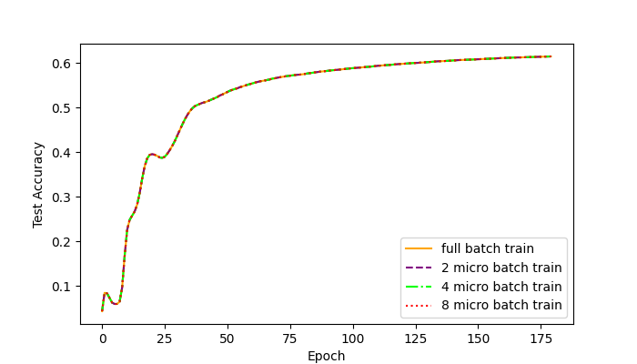

##
###
We would like to show the convergence curves for full-batch training and micro-batch training with three different numbers of batches.
In this way, it can prove the micro batch training won't change the convergence of training.
As hundreds of pre-generated full batch data will cost a lot, here, to simplify the process and save training time, we use 1-layer GraphSAGE model + Mean aggregator using OGBN-arxiv as an example.  

The pre-generated full batch data is stored in ~\Betty\dataset\  
as we use fanout 10, these full batch data of arxiv are stored in folder  ~\Betty\dataset\fan_out_10  

`./run_micro_batch_train.sh` (It might spends one hour. The bottleneck is REG graph partition,  we will optimize it later)
Then you will get the training data for full batch, 2, 4 and 8 micro batch train in folder log/.  
- *1-layer-fo-sage-mean-h-16-batch-XXX-gp-REG.log*  
After that, collect the test accuracy to draw the convergence curve.  
  

