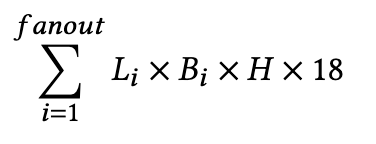

For the workflow of Betty, as the redundancy reduction performance can be found in figure 12, hence, this part we only provide the calculation of memory consumption estimation.  
We introduce the memory consumption estimation of **lstm aggreagtor**.   
We can execute `memory_estimation.py` to collect inforamtion to estimate the memory consumption before pratical execution.  
For example, we use 1-layer GraphSage model + LSTM aggregator using dataset OGBN-arxiv

OGBN-arxiv  
*-----------------------  
Nodes: 169343    
Edges: 2315598  
Train: **90941**  
Val: 29799  
Test: 48603  
Classes: 40  
*-----------------------

The in-degree distribution of the output nodes   
{1: 13428, 2: 11706, 3: 9277, 4: 7320, 5: 6222, 6: 4868, 7: 4045, 8: 3472, 9: 2976, 10: 27627}  
(The total of the output nodes is 90941) 
The number of input nodes: 145047  
The estimation of lstm aggregator memory consumption   
  
 
Given an in-degree $L_i$, the number of nodes with the same in-degree $L_i$ is $B_i$.  
The constant 18 in above Equation is an implementation-dependent. Using PyTorch, the
number of intermediate results generated per node is 18.  
H: hidden size is 128  
The datatype is int32 (4 bytes)  
Each item of **CUDA max memory consumption** equals $L_i$ x $B_i$ x 128 x 18 x 4 bytes  in below table.  
| degree    |   1        |      2    |       3   |     4    |     5    |     6     |    7      |     8    |    9      |     10    |   
|-----------|:----------:|----------:|----------:|---------:|---------:|----------:|----------:|---------:|----------:|----------:|
| L         |    1       |     2     |       3   |     4    |     5    |     6     |    7      |     8    |    9      |     10    |  
| B         |    13428   |   11706   |   9277    |    7320  |    6222  |   4868    | 4045      |   3472   |   2976    |   27627   |
| CUDA max memory consumption (GB)| 0.11525 |0.20094| 0.23887 | 0.25131|0.26701|0.25069| 0.24302|0.23840  |  0.22988  |   2.3712  |

sum of estimated memory consumption equals 4.40GB  
the real memory consumption collected from mini batch training is 4.32208-0.074145 = 4.25GB  
The estimate error is  
(4.40-4.25)/4.25 = 0.15/4.25 = 3.53%  

If the estimated memory consumption is larger than the given memory constraint, we can split the full batch into 2 batches or 4 batches, even more batches, until GNN traininng can be fit into memory limitation.  

Here is an example of full batch train estimation, if you want to test the estimation error of different number of batches, just get the in-degree distribution of each batch to estimate the memory usage based on above Mem_estimate_formula. After that, sum the estiamte memory usage of all batches, then compare with the pratical runtime memory consumption. 
